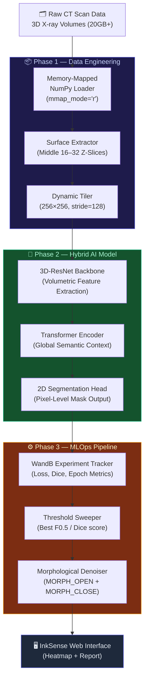
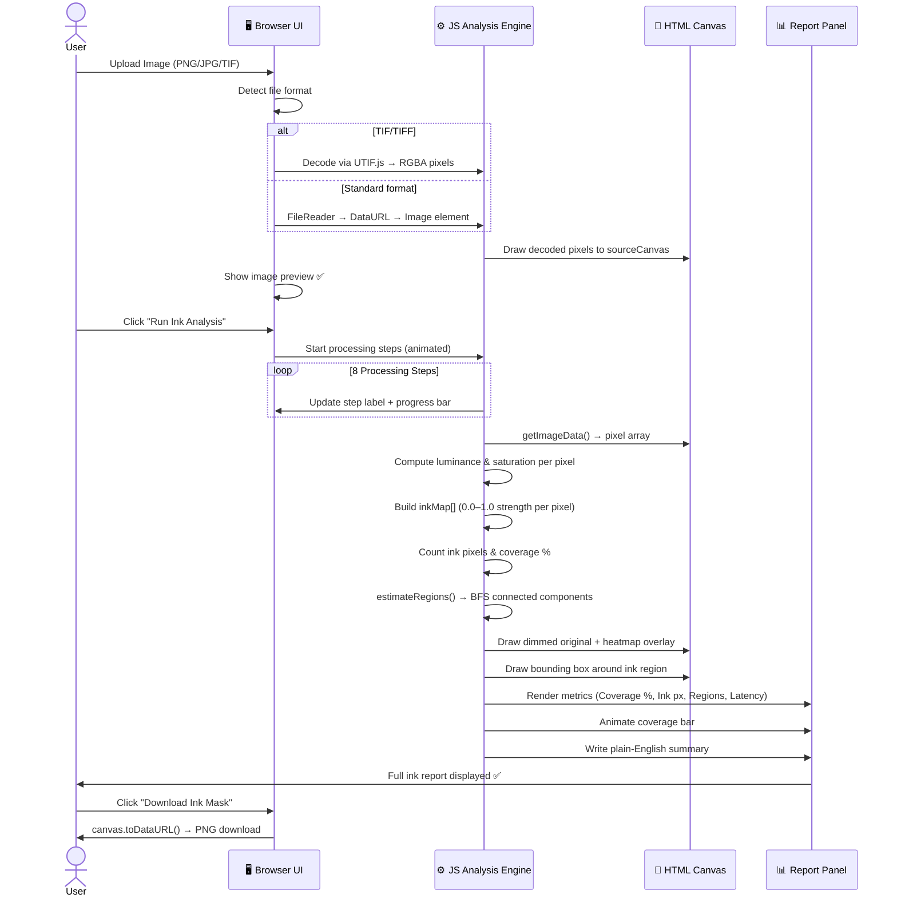

<div align="center">


# 🔬 InkSense
### AI-Powered 3D Ink Detection & Virtual Unrolling Platform

[](https://python.org)
[](https://pytorch.org)
[](https://vitejs.dev)
[](https://wandb.ai)
[](LICENSE)

*Detect, quantify, and map ancient ink from 3D X-ray CT scans of carbonized papyrus fragments — in milliseconds.*

[**🔬 Live Demo**](#-web-interface) · [**🚀 Quick Start**](#-quick-start) · [**🏗️ Architecture**](#-system-architecture) · [**📊 Web Report Flow**](#-web-report-generation-flow)

</div>

---

## 📜 Overview

**InkSense** is an industry-grade AI pipeline built for the **Vesuvius Challenge** — the quest to digitally read thousands of carbonized Greek scrolls buried by Mount Vesuvius in 79 AD.

The pipeline uses a **Hybrid 3D-CNN + Transformer** model to detect the chemical signature of ink residue inside 3D X-ray CT volumes, without physically unrolling or damaging the fragile scrolls. Results are served through a premium web interface that shows ink coverage, heatmaps, and region analysis in real-time.

---

## 🏗️ System Architecture



---

## 🌐 Web Report Generation Flow

> How InkSense transforms a user-uploaded image into a complete ink analysis report.



---

## 🛠️ Technical Stack

| Layer | Technology | Purpose |
|---|---|---|
| **Data** | NumPy `mmap_mode='r'` | Handle 20GB+ CT volumes without RAM overflow |
| **Model** | PyTorch 3D-ResNet + Transformer | Volumetric feature extraction + semantic mapping |
| **Training** | WandB + BCE + Dice Loss | Experiment tracking and hybrid loss optimisation |
| **Post-Processing** | OpenCV Morphology | Threshold sweeping + noise denoising |
| **Web Frontend** | Vite + Vanilla JS | Ultra-fast, zero-framework interactive UI |
| **TIF Decoding** | UTIF.js | Client-side TIFF byte-level decoder |
| **Web Server** | Python `http.server` | Static file serving of production build |
| **Container** | Docker Multi-Stage | Node → Python build pipeline |

---

## 🚀 Quick Start

### 1. Clone & Install
```bash
git clone https://github.com/Ankushsingh003/Ink-Alchemist.git
cd Ink-Alchemist
pip install -r requirements.txt
```

### 2. Prepare Data
```powershell
cd process_fragments
./download_fragment_1.ps1
./unzip_fragment_1.ps1
```

### 3. Run the AI Pipeline
```bash
# Preprocess CT scan volumes
python data_preprocessing.py --fragment 1

# Train the model (10 epochs, WandB logged)
python train.py

# Evaluate & optimise thresholds
python evaluation.py
```

### 4. Launch the Web Interface
```bash
# Serve the InkSense web app
python serve_app.py
# → Open http://localhost:3000
```

---

## 🏆 Industrial Impact

| Trait | Detail |
|---|---|
| 🛡️ **Noise Resilience** | Bypasses CT artifacts and papyrus noise — focuses on the ink's chemical signature |
| ⚡ **Resource Efficiency** | Handles 20GB+ volumes on consumer hardware via memory mapping + tiling |
| 🔬 **Domain Adaptability** | Techniques transfer to Medical AI (CT/MRI tumour segmentation) and Aerospace NDT |
| 🌍 **Cultural Impact** | Enables reading of thousands of lost ancient scrolls without physical damage |

---

## 🏗️ Project Structure

```
InkSense/
├── model.py                  # Hybrid 3D-CNN + Transformer architecture
├── train.py                  # Training loop with WandB integration
├── evaluation.py             # Post-processing & threshold optimisation
├── data_preprocessing.py     # Volume compression and tiling system
├── visualize_impact.py       # Presentation heatmap generator
├── serve_app.py              # Python web server (port 3000)
├── Dockerfile                # Multi-stage Docker build (Node → Python)
├── requirements.txt          # Python dependencies
├── ink-alchemist-web/        # Vite web application (InkSense UI)
│   ├── index.html            # Company website + analyser tool
│   ├── src/
│   │   ├── main.js           # Ink detection engine + UI logic
│   │   └── style.css         # Glassmorphism design system
│   └── dist/                 # Production build (served by serve_app.py)
├── process_fragments/        # Data acquisition PowerShell scripts
├── processed/                # Pre-processed .npy volumes
├── checkpoints/              # Saved model weights
└── results/                  # Output heatmaps and reports
```

---

## 🚀 Deployment (Render)

To deploy this project on Render:

1. **Push to GitHub**: Ensure all changes are pushed to your repository (`github.com/ankushsingh003/Ink-Alchemist`).
2. **Create Web Service**: In Render, click "New" -> "Web Service".
3. **Connect Repo**: Connect your GitHub repository.
4. **Configuration**:
   - **Environment**: `Docker`
   - **Plan**: Any plan (the optimized image is lightweight).
5. **Environment Variables**: Render automatically sets the `PORT` variable.
6. **Deploy**: Click "Create Web Service".

---

<div align="center">

Made with ❤️ for the Vesuvius Challenge · **InkSense** © 2025

</div>
