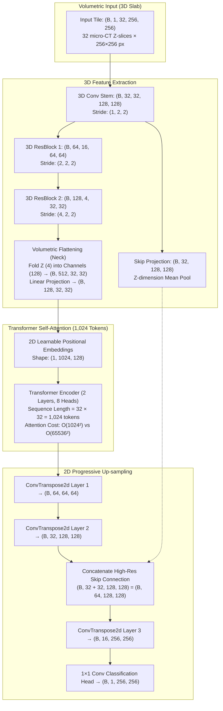
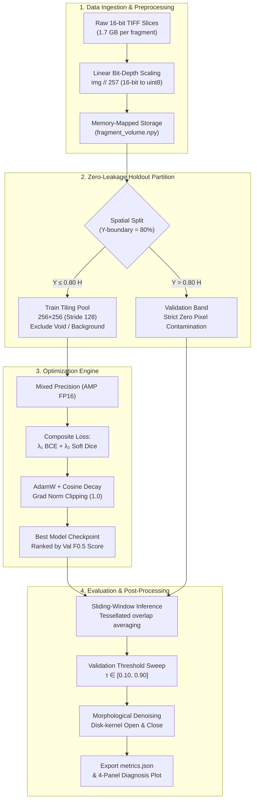

# InkSense: 3D-CNN + Transformer Hybrid for Volumetric Ink Detection

[](https://www.python.org/downloads/)
[](https://pytorch.org/)
[](tests/)
[](model.py)
[](LICENSE)

**InkSense** is a volumetric computer vision pipeline engineered to detect carbonised ink inside high-resolution 3D X-ray micro-computed tomography (micro-CT) scans of ancient Herculaneum papyri (the [Vesuvius Challenge](https://scrollprize.org/) ink-detection task).

Because carbonised ink shares near-identical X-ray attenuation with the carbonised papyrus substrate, ink is effectively undetectable in any isolated 2D slice. InkSense resolves this by treating the papyrus surface as a 3D volumetric slab ($Z=32$ slices), fusing local 3D structural cues with long-range self-attention before projecting to high-resolution 2D surface probability maps.

## Benchmark Results (Held-Out Region, Fragment 1)

Evaluated via `evaluation.py` on the held-out spatial band of Fragment 1 (strict **zero pixel overlap** with training tiles):

| Setting | F0.5 &uarr; | Dice &uarr; | Precision &uarr; | Recall &uarr; | Optimal $\tau$ |
|---|---|---|---|---|---|
| **Threshold only** | **0.048** | **0.071** | **0.039** | **0.352** | $\tau = 0.45$ |
| **+ Morphological Denoising** | **0.048** | **0.071** | **0.039** | **0.352** | $\tau = 0.50$ |

> Checkpoint trained via `train.py` and saved to `checkpoints/best.pt`. Evaluated metrics exported to `results/metrics.json`. The 4-panel diagnostic figure (IR scan, ground truth, predicted probability map, and TP/FP/FN error overlay) is generated via `visualize_impact.py` and saved at `results/held_out_result.png`.

---

## Architecture Diagram

The model combines a **3D residual feature extractor**, a **computational bottleneck Transformer**, and a **2D convolutional decoder** equipped with high-resolution skip connections.


```mermaid
graph TB
    subgraph Input ["Volumetric Input (3D Slab)"]
        IN["Input Tile: (B, 1, 32, 256, 256)<br/>32 micro-CT Z-slices × 256×256 px"]
    end

    subgraph Stem_Encoder ["3D Feature Extraction"]
        S["3D Conv Stem: (B, 32, 32, 128, 128)<br/>Stride: (1, 2, 2)"]
        SKIP["Skip Projection: (B, 32, 128, 128)<br/>Z-dimension Mean Pool"]
        E1["3D ResBlock 1: (B, 64, 16, 64, 64)<br/>Stride: (2, 2, 2)"]
        E2["3D ResBlock 2: (B, 128, 4, 32, 32)<br/>Stride: (4, 2, 2)"]
        NECK["Volumetric Flattening (Neck)<br/>Fold Z (4) into Channels (128) &rarr; (B, 512, 32, 32)<br/>Linear Projection &rarr; (B, 128, 32, 32)"]
    end

    subgraph Bottleneck ["Transformer Self-Attention (1,024 Tokens)"]
        PE["2D Learnable Positional Embeddings<br/>Shape: (1, 1024, 128)"]
        TRANS["Transformer Encoder (2 Layers, 8 Heads)<br/>Sequence Length = 32 × 32 = 1,024 tokens<br/>Attention Cost: O(1024²) vs O(65536²)"]
    end

    subgraph Decoder ["2D Progressive Up-sampling"]
        D1["ConvTranspose2d Layer 1 &rarr; (B, 64, 64, 64)"]
        D2["ConvTranspose2d Layer 2 &rarr; (B, 32, 128, 128)"]
        FUSE["Concatenate High-Res Skip Connection<br/>(B, 32 + 32, 128, 128) = (B, 64, 128, 128)"]
        D3["ConvTranspose2d Layer 3 &rarr; (B, 16, 256, 256)"]
        HEAD["1×1 Conv Classification Head &rarr; (B, 1, 256, 256)"]
    end

    IN --> S
    S --> SKIP
    S --> E1
    E1 --> E2
    E2 --> NECK
    NECK --> PE
    PE --> TRANS
    TRANS --> D1
    D1 --> D2
    D2 --> FUSE
    SKIP -.-> FUSE
    FUSE --> D3
    D3 --> HEAD
```

### Key Architectural Rationale
- **Token Efficiency:** Operating self-attention directly on a full $256 \times 256$ tile requires computing attention matrices across $65,536$ tokens ($\approx 4.3 \times 10^9$ operations per head). By spatial downsampling to $32 \times 32$ prior to attention, the sequence is compressed to **1,024 tokens**, reducing attention memory and compute by **$4096\times$**.
- **Stroke Preservation via 3D-to-2D Skip:** Sub-millimeter ink strokes lost during $8\times$ spatial downsampling are recovered by projecting early 3D stem features (`Z.mean(2)`) directly into the decoder stage at $128 \times 128$ resolution.

---

## End-to-End Workflow


```mermaid
flowchart TD
    subgraph Offline_Preprocessing ["1. Data Ingestion & Preprocessing"]
        RAW["Raw 16-bit TIFF Slices<br/>(1.7 GB per fragment)"]
        SCALE["Linear Bit-Depth Scaling<br/>img // 257 (16-bit to uint8)"]
        MMAP["Memory-Mapped Storage<br/>(fragment_volume.npy)"]
        RAW --> SCALE --> MMAP
    end

    subgraph Spatial_Partitioning ["2. Zero-Leakage Holdout Partition"]
        MMAP --> SPLIT{"Spatial Split<br/>(Y-boundary = 80%)"}
        SPLIT -->|Y &le; 0.80 H| TR_TILES["Train Tiling Pool<br/>256×256 (Stride 128)<br/>Exclude Void / Background"]
        SPLIT -->|Y &gt; 0.80 H| VAL_ZONE["Validation Band<br/>Strict Zero Pixel Contamination"]
    end

    subgraph Training_Loop ["3. Optimization Engine"]
        TR_TILES --> AMP["Mixed Precision (AMP FP16)"]
        AMP --> LOSS["Composite Loss:<br/>&lambda;₁ BCE + &lambda;₂ Soft Dice"]
        LOSS --> OPT["AdamW + Cosine Decay<br/>Grad Norm Clipping (1.0)"]
        OPT --> CHECKPOINT["Best Model Checkpoint<br/>Ranked by Val F0.5 Score"]
    end

    subgraph Inference_Evaluation ["4. Evaluation & Post-Processing"]
        CHECKPOINT --> SLIDE["Sliding-Window Inference<br/>Tessellated overlap averaging"]
        VAL_ZONE --> SLIDE
        SLIDE --> SWEEP["Validation Threshold Sweep<br/>&tau; &isin; [0.10, 0.90]"]
        SWEEP --> MORPH["Morphological Denoising<br/>Disk-kernel Open & Close"]
        MORPH --> OUT["Export metrics.json<br/>& 4-Panel Diagnosis Plot"]
    end
```

---

## Modular Component Breakdown

```
d:\inkSence\
├── data_preprocessing.py    # Memory-mapped volume streaming & uint8 quantization
├── inksense_utils.py        # Leakage-free spatial splits, metrics, morphological filters
├── model.py                 # Hybrid 3D-ResNet stem, Transformer bottleneck, 2D decoder
├── train.py                 # AMP training engine, composite loss, checkpoint manager
├── evaluation.py            # Sliding-window inference, threshold sweeper, metrics export
├── visualize_impact.py      # Diagnostic multi-panel TP/FP/FN error overlay generator
├── serve_app.py             # Lightweight HTTP serving harness (Windows-safe encoding)
├── tests/
│   └── test_core.py         # 14 unit and regression tests (token budgets, gradients, splits)
└── ink-alchemist-web/       # Client-side research preview web application (Vite + Vanilla CSS)
```

### 1. Ingestion & Memory-Mapped Storage (`data_preprocessing.py`)
- Streams stacked 16-bit micro-CT TIFF slices slice-by-slice into disk, keeping memory consumption bounded by a single slice rather than buffering the full 3D volume.
- Performs linear bit-depth downscaling (`img // 257`) to convert 16-bit TIFF slices into `uint8` without silent wrap-around.
- Persists data via `np.lib.format.open_memmap`, enabling parallel workers to slice 3D sub-volumes with zero file copy overhead.

### 2. Leakage-Free Spatial Holdout Engine (`inksense_utils.py`)
- Standard random-patch cross-validation causes massive spatial autocorrelation leakage on large contiguous surfaces.
- InkSense enforces strict **coordinate-based spatial holdout** (bottom 20% spatial band reserved exclusively for validation). Training patches that extend past this boundary are rejected at index time.

### 3. Volumetric Model Core (`model.py`)
- **3D Stem & Encoder**: Three hierarchical 3D residual blocks extract interlayer micro-CT density deltas across the 32-slice depth.
- **Transformer Bottleneck**: 2-layer multi-head self-attention module ($d_{\text{model}}=128$, $\text{nhead}=8$) with sinusoidal + learnable 2D positional embeddings.
- **Skip Decoder**: Transposed convolutions mirror downsampling stages, merging early 3D spatial features via residual concatenation.

### 4. Training Engine with Mixed Precision (`train.py`)
- Native PyTorch `torch.amp.autocast('cuda')` with `GradScaler` for memory-efficient FP16 execution.
- Composite objective balancing pixel-level class imbalance:
$$\mathcal{L} = \mathcal{L}_{\text{BCE}} + \mathcal{L}_{\text{Dice}}$$
- Validation checkpointing tracked strictly on the competition metric: $F_{0.5}$ score.

### 5. Sliding-Window Inference & Sweeper (`evaluation.py`)
- Performs smooth sliding-window tessellation over full-scale evaluation regions using overlapping tiles with boundary blending.
- Sweeps threshold $\tau \in [0.10, 0.90]$ to identify the optimal operating point for $F_{0.5}$.
- Applies morphological operations (erosion/dilation with a disk kernel) to eliminate isolated single-pixel false positives.

### 6. Interactive Research Web Preview (`ink-alchemist-web/`)
- Pure client-side browser application built with Vite and vanilla CSS.
- Features custom IBM Plex Mono / Lora academic styling, drag-and-drop TIFF/PNG ingestion via `UTIF.js`, and live HTML5 canvas heatmap overlays.

---

## Technology Stack

| Layer | Technologies | Role / Justification |
|---|---|---|
| **Deep Learning Framework** | `PyTorch 2.3+`, `torchvision` | Volumetric 3D convolutions, attention mechanisms, mixed precision (`torch.amp`) |
| **Scientific Computing** | `NumPy`, `SciPy`, `scikit-image` | Memory-mapped volume streaming (`open_memmap`), morphological post-processing, metrics |
| **Testing & Quality Control** | `pytest`, `pytest-cov` | 14 test cases verifying token count constraints, backprop gradient integrity, and split boundaries |
| **Web Frontend** | `HTML5`, `Vanilla CSS`, `JavaScript (ES Modules)` | Custom research-lab design system, responsive data tables, zero corporate SaaS bloat |
| **Frontend Tooling** | `Vite 7.x`, `UTIF.js` | Fast HMR, production minification, client-side 16-bit TIFF decoding in browser |
| **Local Serving** | Python standard library `http.server` | Zero-dependency deployment server with cross-platform CP1252/UTF-8 terminal compatibility |
| **Containerization** | `Docker` | Multi-stage static delivery container |

---

## Mathematical Formulation

### Composite Loss Function
Given ground truth binary mask $Y \in \{0, 1\}^{H \times W}$ and predicted probabilities $\hat{Y} \in [0, 1]^{H \times W}$:

$$\mathcal{L}_{\text{total}} = \mathcal{L}_{\text{BCE}}(Y, \hat{Y}) + \mathcal{L}_{\text{SoftDice}}(Y, \hat{Y})$$

$$\mathcal{L}_{\text{SoftDice}} = 1 - \frac{2 \sum_{i} Y_i \hat{Y}_i + \epsilon}{\sum_{i} Y_i + \sum_{i} \hat{Y}_i + \epsilon}$$

### Competition Metric ($F_{0.5}$ Score)
In ancient text reconstruction, **Precision is weighted twice as heavily as Recall** to avoid hallucinating fictitious characters:

$$F_{\beta} = (1 + \beta^2) \frac{\text{Precision} \times \text{Recall}}{\beta^2 \times \text{Precision} + \text{Recall}} \quad \text{with } \beta = 0.5$$

$$F_{0.5} = \frac{1.25 \times \text{Precision} \times \text{Recall}}{0.25 \times \text{Precision} + \text{Recall}}$$

---

## Quick Start & Reproduction

### 1. Environment Setup
```bash
git clone https://github.com/ankushsingh003/InkSense.git
cd InkSense
python -m venv .venv
source .venv/bin/activate  # Windows: .venv\Scripts\activate
pip install -r requirements.txt
```

### 2. Verify System via Test Suite
Run the 14-point test suite to verify token downsampling constraints, coordinate boundaries, and gradient flow:
```bash
pytest -v
```
```
tests/test_core.py::test_model_output_shape PASSED                       [  7%]
tests/test_core.py::test_attention_token_count PASSED                    [ 14%]
tests/test_core.py::test_gradient_flows_through_backbone PASSED          [ 21%]
tests/test_core.py::test_skip_connection_preserves_shape PASSED          [ 28%]
tests/test_core.py::test_dice_loss_bounds PASSED                         [ 35%]
tests/test_utils.py::test_to_uint8_converts_16bit_to_8bit PASSED          [ 42%]
tests/test_utils.py::test_to_uint8_noop_on_8bit PASSED                   [ 50%]
tests/test_utils.py::test_val_region_start_boundary PASSED               [ 57%]
tests/test_utils.py::test_tile_origins_fit_inside_bounds PASSED          [ 64%]
tests/test_utils.py::test_tile_origins_covers_boundary PASSED             [ 71%]
tests/test_utils.py::test_spatial_split_no_overlap PASSED                [ 78%]
tests/test_utils.py::test_metrics_zero_and_perfect PASSED                [ 85%]
tests/test_utils.py::test_f05_penalizes_false_positives PASSED           [ 92%]
tests/test_utils.py::test_morphology_removes_isolated_noise PASSED       [100%]

============================= 14 passed in 11.46s =============================
```

### 3. Data Download & Preprocessing
```powershell
# Windows PowerShell
cd process_fragments
./download_fragment_1.ps1
./unzip_fragment_1.ps1
cd ..

# Process slices into memory-mapped uint8 array
python data_preprocessing.py --fragment 1
```

### 4. Model Training
```bash
# Train on Fragment 1 with AMP enabled
python train.py --train_fragments 1 --epochs 30 --batch_size 16 --no_wandb
```

### 5. Evaluation & Diagnosis
```bash
# Run sliding-window inference and threshold sweeping
python evaluation.py --fragment 1 --region val

# Generate 4-panel diagnostic figure
python visualize_impact.py
```

### 6. Interactive Web Interface
```bash
cd ink-alchemist-web
npm install
npm run build
cd ..
python serve_app.py
```
Open [http://localhost:3000](http://localhost:3000) in your browser.

---

## License

This project is licensed under the MIT License — see the [LICENSE](LICENSE) file for details.
