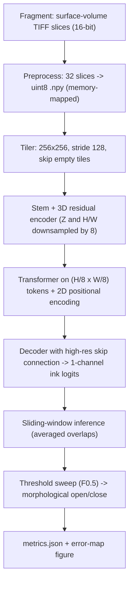

# InkSense — Ink Segmentation in High-Resolution CT Volumes

Segments carbonised ink in X-ray CT scans of papyrus fragments (the Vesuvius Challenge ink-detection task) with a
3D-CNN + Transformer trained in PyTorch. The repo contains the full pipeline: preprocessing, tiled training with a
leakage-free held-out split, evaluation on real predictions, and a small in-browser preview.

> **What is and isn't in the web demo.** `ink-alchemist-web/` is a client-side *heuristic preview*
> (luminance/saturation scoring + connected regions). It does **not** run the trained model. All model results below
> come from `train.py` / `evaluation.py`.

## Results (held-out region, Fragment 1)

Fill this table from `results/metrics.json` after running the pipeline. Do not publish numbers you have not reproduced.

| Setting | F0.5 | Dice | Precision | Recall |
|---|---|---|---|---|
| Threshold only | _run evaluation.py_ | | | |
| + morphological denoising | _run evaluation.py_ | | | |

Validation is a spatial band (bottom 20 % of the fragment) that shares **no pixels** with any training tile.
Best checkpoint is chosen by validation F0.5, the competition metric. Tuning the threshold on the same band is mildly
optimistic; for an unbiased number, tune on the band and evaluate a different fragment with `--threshold`.

## Pipeline


```mermaid
graph TD
    A["Fragment: surface-volume TIFF slices (16-bit)"] --> B["Preprocess: 32 slices -> uint8 .npy (memory-mapped)"]
    B --> C["Tiler: 256x256, stride 128, skip empty tiles"]
    C --> D["Stem + 3D residual encoder (Z and H/W downsampled by 8)"]
    D --> E["Transformer on (H/8 x W/8) tokens + 2D positional encoding"]
    E --> F["Decoder with high-res skip connection -> 1-channel ink logits"]
    F --> G["Sliding-window inference (averaged overlaps)"]
    G --> H["Threshold sweep (F0.5) -> morphological open/close"]
    H --> I["metrics.json + error-map figure"]
```

Key design choices

- **Attention cost:** self-attention runs on 1,024 tokens per 256x256 tile (after 8x downsampling), not on 65,536
  pixels, and a full-resolution skip connection restores thin strokes. A unit test guards this.
- **Loss:** BCE + soft Dice restricted to valid (papyrus) pixels, because ink is sparse.
- **Data handling:** volume stored as uint8 and read through `mmap`; 16-bit TIFFs are rescaled (not truncated). The
  32-slice stack of Fragment 1 (8181 x 6330 px) is about 1.7 GB.
- **Training:** AdamW + cosine schedule, mixed precision on GPU, flip/rotate/brightness augmentation, seeded.

## Quick start

```bash
pip install -r requirements.txt
cd process_fragments && ./download_fragment_1.ps1 && ./unzip_fragment_1.ps1 && cd ..   # Windows / PowerShell

python data_preprocessing.py --fragment 1
python train.py --train_fragments 1 --epochs 10          # add --no_wandb to disable logging
python evaluation.py --fragment 1 --region val           # writes results/metrics.json
python visualize_impact.py                               # writes results/held_out_result.png
pytest                                                   # torch tests skip automatically if torch is missing
```

For a stricter test, train on fragments 1 and 2 and hold out fragment 3:
`python train.py --train_fragments 1 2 --val_fragments 3`.

## Web preview

```bash
cd ink-alchemist-web && npm install && npm run build && cd ..
python serve_app.py        # http://localhost:3000
```

The Docker image serves only this static page (standard-library Python, no ML dependencies).

## Limitations

- Trained on one fragment by default; generalisation to unseen fragments is exactly what `--val_fragments` measures.
- The preview is a heuristic and is not a substitute for the model.
- Domain is CT of papyrus. The approach (tiled segmentation of a sparse target in very large images) transfers to
  other large-image settings such as digital pathology, but no medical data was used here.
